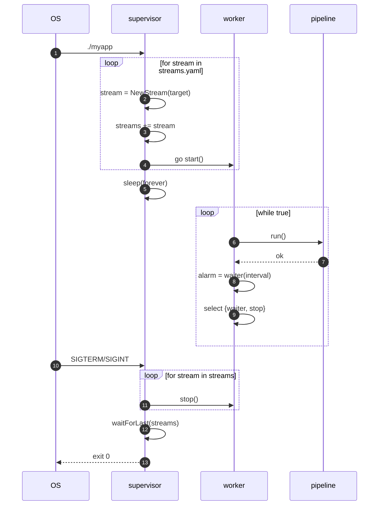

```mermaid
sequenceDiagram
    autonumber
    participant OS
    participant SUP as supervisor
    participant WRK as worker
    participant PIP as pipeline

    OS->>SUP: ./myapp

    loop for stream in streams.yaml
        SUP->>SUP: stream = NewStream(target)
        SUP->>SUP: streams += stream
        SUP->>WRK: go start()
    end

    SUP->>SUP: sleep(forever)

    loop while true
        WRK->>PIP: run()
        PIP-->>WRK: ok
        WRK->>WRK: alarm = waiter(interval)
        WRK->>WRK: select {waiter, stop}
    end

    OS->>SUP: SIGTERM/SIGINT

    loop for stream in streams
        SUP->>WRK: stop()
    end

    SUP->>SUP: waitForLast(streams)

    SUP-->>OS: exit 0
```