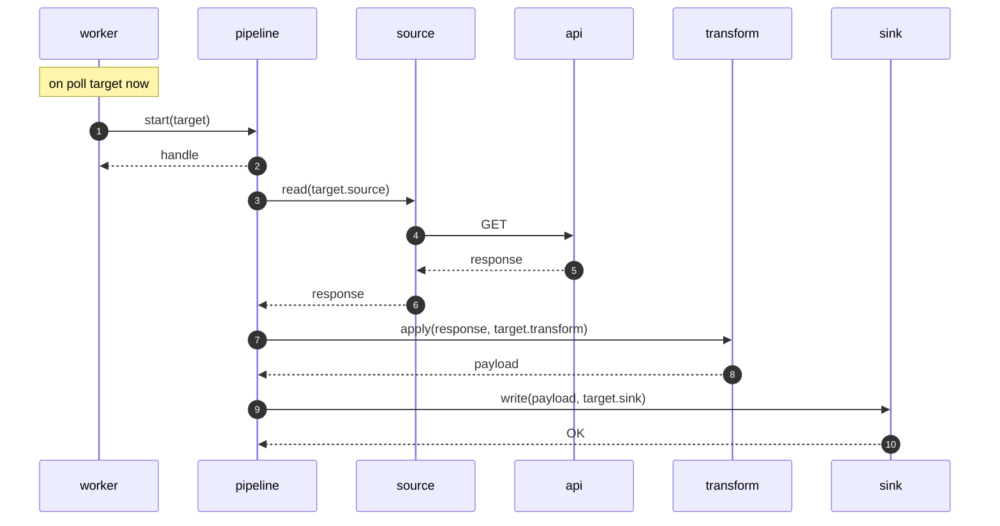

```mermaid
sequenceDiagram
    autonumber
    participant WRK as worker
    participant PIP as pipeline
    participant SRC as source
    participant API as api
    participant TFM as transform
    participant SNK as sink

    note over WRK: on poll target now
    WRK->>PIP: start(target)
    PIP-->>WRK: handle

    PIP->>SRC: read(target.source)
    SRC->>API: GET
    API-->>SRC: response
    SRC-->>PIP: response

    PIP->>TFM: apply(response, target.transform)
    TFM-->>PIP: payload

    PIP->>SNK: write(payload, target.sink)
    SNK-->>PIP: OK
```